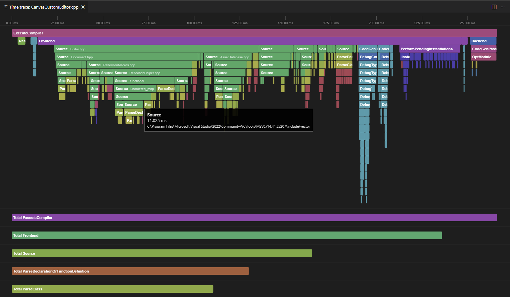

# Clang Time Tracer

**Clang Time Tracer** is a visualizer for Clang's `-ftime-trace` data. It allows C++ developers to profile their builds and identify which headers or functions are slowing down compilation.

## Features

* **Build & Analyze**: Automatically injects `-ftime-trace` into your compiler arguments and launches the visualization for the current file.
* **Canvas Renderer**: A custom 2D Canvas engine designed to handle large trace files with smooth zooming and panning.

## How it works

The extension leverages the `-ftime-trace` flag (available in Clang 9+ and `clang-cl`). When triggered, it:
1. Locates the compilation command for the active file.
2. Executes the compiler with the tracing flag enabled.
3. Parses the resulting JSON trace and generates an interactive timeline within a VS Code Webview.

## Requirements

* **Compilation Database**: A `compile_commands.json` file is required in your workspace (usually generated by CMake, Bear, or Meson).
* **Clang Compatibility**: Your `compile_commands.json` must use `clang` or `clang-cl` as the compiler.

## Extension Settings

This extension contributes the following settings:

* `clangTimeTracer.compileCommands.path`: The relative path to the folder containing your `compile_commands.json`. Defaults to the `build` folder.

## Usage & Troubleshooting

1. Open a C++ source file (`.cpp`, `.cxx`, `.cc`, etc.).
2. Run the command: **Clang Time Tracer: Build and Analyze**.
3. Use the **Mouse Wheel** to zoom and **Click & Drag** to pan.

### Important Note on Build Systems
Since this extension executes the compiler command directly from `compile_commands.json` without invoking your full build system (CMake, Bazel, Meson, etc.), you may need to **manually run a build once** before analyzing. This ensures that any dynamically generated elements—such as generated headers, Protobuf files, or Precompiled Headers (PCH)—are available for the compiler.

## Release Notes

### 1.0.0
* Initial release.

---

**Enjoy faster builds!**