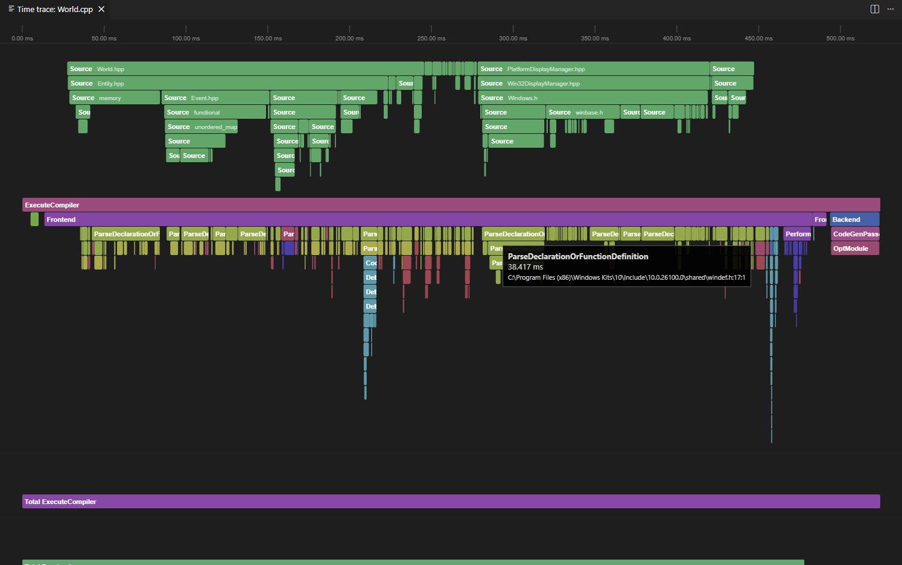
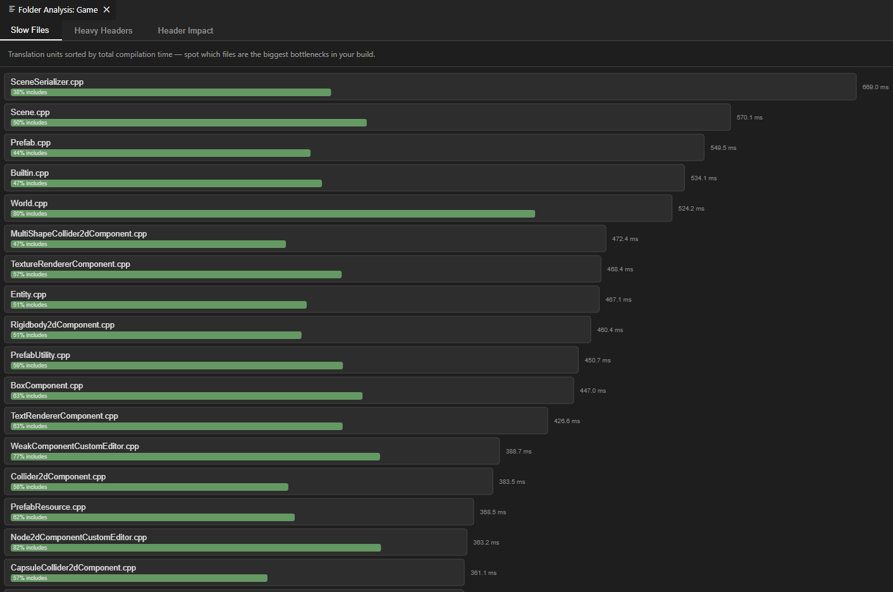
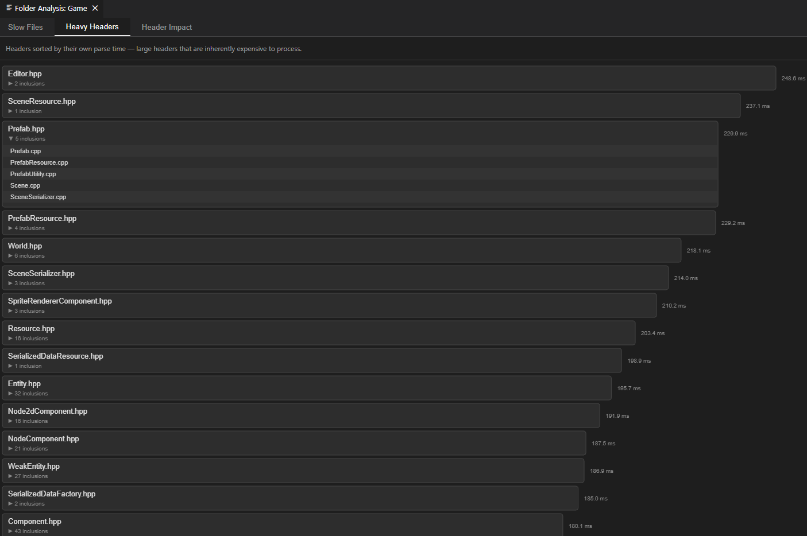
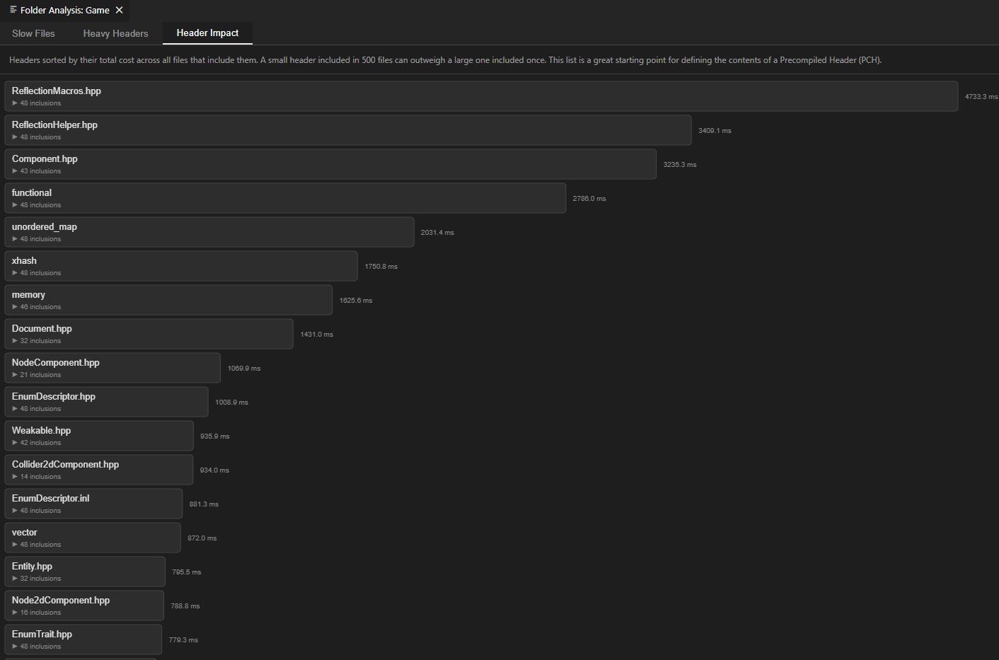

# Clang Time Tracer

**Clang Time Tracer** is a visualizer for Clang's `-ftime-trace` data. It allows C++ developers to profile their builds and identify which headers or functions are slowing down compilation.

## How it works

The extension leverages the `-ftime-trace` flag (available in Clang 9+). When triggered, it:
1. Locates the compilation command for the active file.
2. Executes the compiler with the tracing flag enabled.
3. Parses the resulting JSON trace and generates an interactive timeline within a VS Code Webview.

## Requirements

* **Compilation Database**: A `compile_commands.json` file is required in your workspace (usually generated by CMake, Bear, or Meson).
* **Clang Compatibility**: Your `compile_commands.json` must use `clang` or `clang-cl` as the compiler.

## Extension Settings

This extension contributes the following settings:

* `clangTimeTracer.compileCommands.path`: The relative path to the folder containing your `compile_commands.json`.  
Defaults to the `build` folder.

## Usage & Workflows

**Clang Time Tracer** offers two ways to analyze your build performance depending on your needs:

### 1. File Level: Deep Dive Analysis
Perfect for optimizing a specific source file that feels sluggish.
* **How to run**: Open a C++ file and run the command `Clang Time Tracer: Trace file`.
* **Result**: Launches an interactive timeline of the compilation process.
* **Navigation**: Use **Mouse Wheel** to zoom and **Click & Drag** to pan.

### 2. Folder Level: Project Overview
Ideal for identifying project-wide bottlenecks and finding candidates for Precompiled Headers (PCH).
* **How to run**: 
	* Right-click any folder in the **Explorer** and select `Clang Time Tracer: Trace folder`.
	* OR run `Clang Time Tracer: Trace folder` from the Command Palette (a folder picker will help you target the directory).
* **Result**: Analyzes all generated trace files in the folder and opens a dashboard with three specialized visualizers:
	* **Slow Files**: Identifies the source files that take the longest to compile. *Double-click a file to open its detailed trace timeline.*
	* **Heavy Headers**: Highlights headers with the highest "self-time" (cost of parsing the header itself).
	* **Header Impact**: Shows headers with the highest cumulative time across all files. This is the ultimate tool to decide which headers should go into a **PCH**.

## Troubleshooting & Requirements

* **Build First**: Since the extension executes compiler commands directly from `compile_commands.json`, you must **manually run your build once** (via CMake, Ninja, etc.) before tracing. This ensures generated headers (Protobuf, etc.) or PCHs are present.
* **Compilation Database**: A `compile_commands.json` is required. You can point the extension to it via the `clangTimeTracer.compileCommands.path` setting (defaults to the `build` folder).
* **Clang 9+**: Ensure your compiler is Clang-based to support the `-ftime-trace` flag.

---

**Enjoy faster builds!**